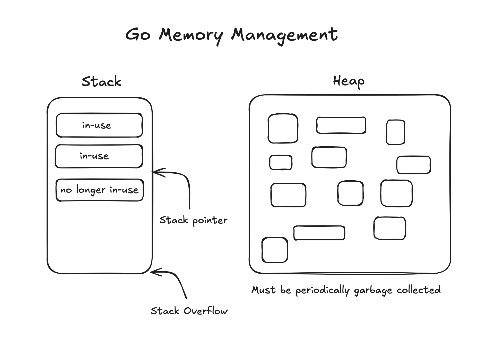

# Session 1: Go Fundamentals & Memory Management

**Duration:** 2 hours | **Focus:** Language Fundamentals, Data Types, Pointers, Control Flow

## Overview

This session covers the fundamental building blocks of Go programming, with special emphasis on memory management, data structures, and core language features that form the foundation for all Go development.

Stack vs Heap Diagram: 
- https://excalidraw.com/#json=NS0C5hauHy7hDrIk41yOl,XlegZDgrzyMYgXGad98ZAg
- 

## Session Outline

### 1. [Go Basics - Variables and Types](./01-go-basics-variables-and-types/)
- [Variable Declarations](./01-go-basics-variables-and-types/01-variable-declarations.md)
- [Basic Data Types](./01-go-basics-variables-and-types/02-basic-data-types.md)
- [Zero Values](./01-go-basics-variables-and-types/03-zero-values.md)
- [Constants and iota](./01-go-basics-variables-and-types/04-constants-and-iota.md)

### 2. [Data Structures](./02-data-structures/)
- [Arrays (Fixed Size)](./02-data-structures/01-arrays-fixed-size.md)
- [Slices (Dynamic Arrays)](./02-data-structures/02-slices-dynamic-arrays.md)
- [Maps (Hash Tables)](./02-data-structures/03-maps-hash-tables.md)
- [Structs](./02-data-structures/04-structs.md)

### 3. [Pointers - Deep Dive](./03-pointers-deep-dive/)
- [Pointer Fundamentals](./03-pointers-deep-dive/01-pointer-fundamentals.md)
- [Pointers with Structs](./03-pointers-deep-dive/02-pointers-with-structs.md)
- [Method Receivers - Value vs Pointer](./03-pointers-deep-dive/03-method-receivers-value-vs-pointer.md)
- [Pointer Gotchas and Race Conditions](./03-pointers-deep-dive/04-pointer-gotchas-and-race-conditions.md)

### 4. [Control Structures](./04-control-structures/)
- [If Statements](./04-control-structures/01-if-statements.md)
- [Switch Statements](./04-control-structures/02-switch-statements.md)
- [Loops (for is the only loop)](./04-control-structures/03-loops-for-is-the-only-loop.md)
- [Control Flow Keywords](./04-control-structures/04-control-flow-keywords.md)

### 5. [Functions](./05-functions/)
- [Function Basics](./05-functions/01-function-basics.md)
- [Function Types and Values](./05-functions/02-function-types-and-values.md)
- [Defer, Panic, and Recover](./05-functions/03-defer-panic-and-recover.md)

### 6. [Interfaces and Type System](./06-interfaces-and-type-system/)
- [Interface Basics](./06-interfaces-and-type-system/01-interface-basics.md)
- [Implementing Interfaces](./06-interfaces-and-type-system/02-implementing-interfaces.md)
- [Type Assertions and Type Switches](./06-interfaces-and-type-system/03-type-assertions-and-type-switches.md)

### 7. [Error Handling](./07-error-handling/)
- [Error Interface](./07-error-handling/01-error-interface.md)
- [Error Handling Patterns](./07-error-handling/02-error-handling-patterns.md)

## Practice & Assessment

- [Practice Problems - Rapid Fire](./08-practice-problems-rapid-fire.md)
- [Common Interview Questions](./09-common-interview-questions.md)
- [Quick Reference - Common Patterns](./10-quick-reference-common-patterns.md)
- [Specific Homework Assignments](./11-specific-homework-assignments.md)

## Key Learning Objectives

By the end of this session, you should be able to:

- [ ] Explain when to use pointer vs value receivers
- [ ] Create and manipulate slices, maps, and structs
- [ ] Handle errors idiomatically
- [ ] Use all Go control structures
- [ ] Implement interfaces implicitly
- [ ] Debug common pointer mistakes

---

**Next Session:** [Session 2: Concurrency Foundations](../session2/session2.md)